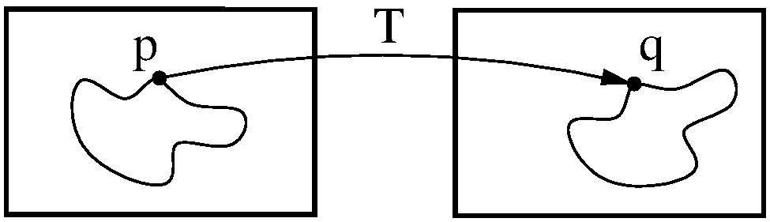

.. _Introduction:

Introduction
============

If you are completely new to SimpleElastix, or even medical image registration in general, you might not know where to start or what questions to ask. This section will walk you through the basics.

Image Registration
------------------

Image registration is the process of transforming images into a common coordinate system so corresponding pixels represent homologous biological points. For example, registration can be used to obtain an anatomically normalized reference frame in which brain regions from different patients can be compared. Computer scientists and medical doctors use this information to build computational models of disease processes.

In the past decade there has been increasing interest in relating information in different medical images spurred by a growing availability of scanners, modalities and computing power. Clinical applications include segmentation of anatomical structures, computer-aided diagnosis, monitoring of disease progression, surgical intervention and treatment planning. 

A significant amount of research has focused on developing the registration algorithms themselves. However, less research has focused on accessibility, interoperability and extensibility of these algorithms. Scientific source code is typically not published, is difficult to use because it has not been written with other researchers in mind or is lacking documentation. This is a problem since image registration is a prerequisite for a wide range of medical image analysis tasks and a key algorithmic component for image-based studies. Open source, user-friendly implementations of scientific software make state-of-the-art methods accessible to a wider audience, promote opportunities for scientific advancement, and support the fundamental scientific principle of reproducibility. To this end, we have developed the SimpleElastix software package.

SimpleElastix
-------------

Elastix \cite{Klein2010} is an open source, command-line program for intensity-based registration of medical images that allows the user to quickly configure, test, and compare different registration methods. SimpleElastix is an extension of SimpleITK \cite{Lowekamp2013} that allows you to configure and run Elastix entirely in Python, Java, R, Octave, Ruby, Lua, Tcl and C\# on Linux, Mac and Windows. The goal is to bring robust registration algorithms to a wider audience and make it easier to use elastix, e.g. for Java-based enterprise applications or rapid Python prototyping. 

A lot of research has focused on making SimpleElastix computationally efficient and easy to use. Stochastic sampling (Klein et al. 2007), multi-threading and code optimizations (Shamonin et al 2014) makes registration run fast without sacrificing robustness. A simple parameter interface and modular architecture allows you to configure registration components at runtime and easily try out different registration methods. 

Previously, performing these kinds of operations on large datasets would incur a significant workflow overhead from scripting command line invocations and arguments to copying images and transform parameter files across folders. With SimpleElastix and SimpleTransformix this complexity is easier to manage and more memory and disk I/O efficient. 

Mathematical Background
-----------------------

The registration concept is schematically depicted in Figure 1. A standard image registration procedure involves two input images: One is defined as the fixed image :math:`I_F(x)` and the other as moving image :math:`I_M(x)`. :math:`x` denotes the :math:`d`-dimensional position in the image. If you are registering images taken with your iPhone, :math:`d = 2` and :math:`x` will have two components, one for each dimension of the 2D plane. If you are registering body parts taken with a CT scanner, :math:`d = 3` and :math:`x` will have three components, one for each of spatial dimension. You may also encounter time series which are four-dimensional (3D+time).

A transform :math:`T(x)` represents the spatial mapping of points from the fixed image :math:`p` to points in the moving image :math:`q`. This establishes a correspondence for every pixel in the fixed image to a position in the moving image. 

    Figure 2: Image registration is the act of deforming moving image points :math:`p` to biologically corresponding points :math:`q` in the fixed image domain.

A similarity metric provides a measure of how well the fixed image matches the moving image. This measure forms a quantitative criterion to be optimized by an optimizer over the search space defined by the parameters of the transform. In general, the registration procedure is formulated as an optimization problem in which a cost function :math:`C` is minimized with respect to :math:`T`. Mathematically, :math:`I_M(x)` is deformed to match :math:`I_F(x)` by finding a coordinate transformation :math:`T(x)` that makes :math:`I_M(T(x))` spatially aligned with :math:`I_F(x)`. This simply means that the optimizer adjusts the parameters of the transform in a way that minimizes the difference between the two images.

The metric is a key component in the registration process. It uses information from the fixed and moving image to compute a similarity value. The derivative of this value tells us in which direction we should move the moving image for better alignment. The moving image is moved in small steps, and thes process is repeated until a convergence criteria is met. The metric can use pixel intensities, point positions, pre-computed image features or anything we might want to optimize. We just have to define a metric for it.

Sometimes a regularisation term is added to the cost function to penalize unwanted transformations. For example, if we expect your transform to be reasonably smooth, we can penalize sharp deformations. Further, a multi-resolution approach is typically adopted where we start with a high level of smoothing and gradually sharpen the images. This increases the capture range and makes registration much less prone to local minima. 

Many different transforms, metrics and optimizers are available in SimpleElastix. In theory, the combinatorial number of choices of registration components can be daunting. In practice, you will develop an intuition about which algorithms are better suited to different types of problems. Choosing the right method for a particular problem will always be a trial-and-error process even for experts, but with the right tools you can focus more on the problem and less on implementation.

Registration Components
-----------------------

In this section we introduce common terminology and some of the choices for different types of components. For a technical discussion and equations see the `elastix manual <http://elastix.isi.uu.nl/download/elastix_manual_v4.7.pdf>`_. For documentation of source code see the `elastix doxygen pages <http://elastix.isi.uu.nl/doxygen/index.html>`_ where you will also find a `complete list of available parameters <http://elastix.isi.uu.nl/doxygen/parameter.html>`_.

Image Pyramids
~~~~~~~~~~~~~~

A multi-resolution pyramid strategy improves the capture range and robustness of the registration. There are three types of pyramids available in elastix: SmoothingImagePyramid, RecursiveImagePyramid and ShrinkingImagePyramid. The FixedImagePyramid and the MovingImagePyramid have identical options. The SmoothingImagePyramid smoothes the images with a Gaussian kernel at different scales. The RecursiveImagePyramid smoothes and downsamples the image. The ShrinkingImagePyramid merely downsamples the image. In general, you should be using the SmoothingImagePyramid together with a random sampler, since it will not throw away valuable information and a few thousead samples is often sufficient for a good approximation to the true gradient. It may consume quite some memory for large images and many resolution levels, however. 

Two parameters have to be set to define the multi-resolution strategy: :code:`NumberOfResolutions` and :code:`ImagePyramidSchedule`. The pyramid schedule defines the amount of blurring and/or down-sampling in each direction x, y, z and for each resolution level. If you only set the :code:`NumberOfResolutions`, a default schedule will be used that smoothes the fixed image by a factor of 2 in each dimension, starting from :math:`\sigma = 0.5` in the highest resolution. This schedule is usually fine. If you have highly anisotropic data, you might want to blur less in the direction of the largest spacing.

In general, 3 resolutions are sufficient. If the fixed and moving image are initially far away, you can increase the number of resolution levels to, say, 5 or 6. This way more attention is paid to register large, dominant structures in the beginning. The resolution schedule is specified as follows:

::

    (NumberOfResolutions 4)
    (FixedImagePyramidSchedule 8 8 8 4 4 4 2 2 2 1 1 1)

In this example, 4 resolutions are used for a 3D image. At resolution level 0 the image is blurred with :math:`\sigma = 8/2`
voxels in each direction (:math:`\sigma` is half the pyramid schedule value). At level 1 :math:`\sigma = 4/2` is used, and finally at level 4 the original images are used for registration. 

SimpleElastix can automatically configure these options for you if you use the default parameter maps.

Masks
~~~~~

You may encounter problems where you are more interested in aligning substructures than global anatomy. For example, 4D CT images of lungs vary considerably due to breathing motion and you may not want to align the more static rib cage at the expense of lung overlap. One possibility is to crop the image, but this approach restricts the Region Of Interest (ROI) to be a square (2D) or cube (3D) only. If you need an irregular shaped ROI, you can use masks. A mask is a binary image filled with 0’s and 1’s. Intensity values are only sampled within regions filled with 1's.

You should use a mask when: 

- Your image contains an artificial edge that has no real meaning. The registration might be tempted to align these artificial edges, thereby neglecting the meaningful edges. The conic beam edge in ultrasound images is an example of such an artificial edge.
- The image contains structures in the neighbourhood of your ROI that may influence the registration within your ROI as in the lung example.

Masks can be used both for fixed and moving images. A fixed image mask is sufficient to focus the registration on a ROI, since sample positions are drawn from the fixed image. You only want to use a mask for the moving image when your moving image contains highly pertubed grey values near the ROI.

In case of multi-resolution registation you need to set :code:`(ErodeMask "true")` if you do not want information from the artificial edge to flow into you ROI during the smoothing step. If the edge around your ROI is meaningful, as in the lung example where the edges of lungs needs to be aligned, you should set it to false, because the edge will help to guide the registration.

Transforms
~~~~~~~~~~

The choice of transform is essential for successful registration and, perhaps more importantly, what we perceive as "successful". The transform reflects the desired type of transformation and constrain the solution space to that type of deformation. For example, in intra-subject applications it may be sufficent to consider only rigid transformations if you are registering bones, while a cross-sectional study demands more flexible transformation models to allow for normal anatomical variability between patients.

The number of parameters of the transform corresponds to the degrees of freedom (DOF) of the transformation. This number varies greatly from 3 DOFs for 3D translation and 12 DOFs for 3D affine warping to anywhere between hundreds and millions of DOFs for b-spline deformation fields and non-parametric methods.

The number of DOFs is equal to the dimensionality of the search space and directly proportional to the computational complexity of the optimization problem. The computational complexity affects running time and likelihood of convergence to an optimal solution. Notice that there is a distinction between convergence to an optimal solution and a good registration result. If we use a 2D translation transform embedded in a multi-resolution approach, chances are we will find the global optimal solution. That does not garuantee a good level of anatomical correspondence, however, which will most likely require a more complex deformation model. On the other hand, registering complex anatomical structures using a b-spline deformation without proper initialization is most likely going to fail. Therefore it is often a good idea to start with simple transforms and propagate solutions through transforms of gradually increasing complexity. 

Some common transforms are (in order of increasing complexity) translation, rigid (rotation, translation), Euler (rotation, translation), affine (rotation, translation, scaling, shearing), b-spline (non-rigid), Spline-Kernel Transform (non-rigid) and weighted combinations of any of these.

In elastix, the transform is defined from the fixed image to the moving image. It may seem counter-intuitive that the transform is defined in this direction, since it is the moving image we want to transform. Would it not be more logical to map each pixel in the moving image to its new position in fixed image? Perhaps, but then two pixels from the moving image might be mapped to the same pixel on the fixed grid and some pixels in the fixed image might not be mapped to at all. The chosen convention allows us to iterate over the fixed image and pick a pixel from the moving image for every pixel in the fixed image. 

Metrics
~~~~~~~

The similarity metric measures the degree of similarity between the moving and fixed image and is a key component in the registration process. The metric samples intensity values from the fixed and transformed moving image and evaluates the fitness value and derivatives, which are passed to the optimizer. 

Selecting an appropriate metric is highly dependent on the registration problem to be solved. For example, some metrics have a large capture range while others require initialization close to the optimal position. In addition, some metrics are only suitable for comparing images obtained from the same imaging modality, while others can handle inter-modality comparisons. There are no clear-cut rules as to how to choose a metric and it may require a trial-and-error process to find the best metric for a given problem.

The Mean Squared Difference (SSD) metric computes the mean squared pixel-wise intensity differences between the fixed and moving images. The optimal value of the metric is zero. Poor matches are result in large values of the metric. The metric samples intensity values from the fixed and transformed moving image and evaluates the fitness value and derivatives, which are passed to the optimizer. This metric relies on the assumption that intensity representing the same homologous point must be the same in both images and only suited for two images with the same intensity distributions, i.e. for images from the same modality.

Normalized Correlation Coefficient (NCC) computes pixel-wise cross-correlation normalized by the square root of the autocorrelation of the images. The metric is invariant to linear differences between intensity distributions and is therefore particularly well suited for intra-modal CT registration where intensity scales are always related by a linear transform even between scanners. This metric produces a cost function with sharp peaks and well-defined minima, but therefore has a relatively small capture radius.

The Mutual Information (MI) measure computes the mutual information between two images and is more general. MI is a measure of how much information one random variable (image intensity in one image) tells about another random variable (image intensity in the other image). This corresponds to measuring the dependency of the probability density distributions (PDF) of the intensities of the fixed and moving images without having to specify the actual form of the dependency. It is therefore well suited for multi-modal image pairs as well as mono-modal images.  Normalized Mutual Information is likewise suitable for both mono- and multi-modality registration. Some studies seem to indicate better performance with NMI than MI in some cases.

Mattes Mutual Information is an implementation where the same pixels are sampled in every iteration. Using a fixed set of discrete positions to evaluate the marginal and joint PDFs makes the path in search space more smooth.

The Kappa Similarity metric measures the overlap of segmented structures and is developed specifically to register binary images (segmentations). In most cases however, it is better to convert the binary images to a distance map and apply one of the usual metrics. 

Optimizers
~~~~~~~~~~

The optimizer estimates the optimal transform parameters in iterative fashion. Many optimizers are available in elastix including Gradient Descent (GD), Robbins-Monroe (RM), Adaptive Stochastic Gradient Descent (ASGD), Conjugate Gradient (CG), Conjugate Gradient FRPR, Quasi-Newton LBFGS, RSGD "Each parameter apart", Simultaneous Pertubation (SP), CMAEvolutionStrategy and FullSearch which samples the entire search space. If you do not have any immediate preferences, stick to the Adaptive Stochastic Gradient Descent (Klein 2009) which requires less parameters to be set and tends to be more robust. For an elabore discussion see the `elastix manual <http://elastix.isi.uu.nl/download/elastix_manual_v4.7.pdf>`_.

Samplers
~~~~~~~~

The sampler is responsible for selecting locations in input images for the metric to evaluate. In general, it is sufficient to evaluate only a subset of randomly sampled voxels. SimpleElastix comes with a grid, random, random coordinate and full sampling strategies selected using the :code:`ImageSampler` parameter.

The grid sampler defines a regular grid on the fixed image and selects the coordinates onthe grid. Effectively, the image is down-sampledwithout smoothing. The size of the grid or downsampling factor is taken as input. The random sampler randomly selects a user-specified number of voxels. Every voxel has equal chance to be selected and a sample may be selected more than once. The random coordinate sampler is not limited to voxel positions but may sample positions between voxels. The off-grid grey-level values are obtained via in interpolation.

Interpolators
~~~~~~~~~~~~~
The metric typically compares intensity values in the fixed image against the corresponding values in the transformed moving image. When a point is mapped from one space to another by a transform, it will generally be mapped to a non-grid position. Interpolation is required to evaluate the image intensity at the mapped off-grid position.

Several methods for interpolation exist, varying in quality and speed. The :code:`NearestNeighborInterpolator` returns the value of the spatially closest voxel. This technique is low in quality but require little resources. You will want to use this method for binary images.

The :code:`LinearInterpolator` returns a weighted average of surrounding voxels using distances as weights. In elastix, this method is highly optimized and very fast. In general, you will probably want to use this method together with the random coordinate sampler during the optimization process for best performance (in the time sense).

The :code:`BSplineInterpolator` (or the more memory effecient :code:`BSplineInterpolatorFloat`) interpolates pixel values using b-spline approximations of user-defined order :math:`N`. First order b-splines corresponds to linear intepolation in which case you might as well use the linear interpolator. To generate the final result image a higher-order interpolation is usually required for which :math:`N = 3` is recommended. The final interpolator is called a ResampleInterpolator. Any one of the above methods can be used, but you need to prepend the name with Final, for example :code:`FinalBSplineInterpolatorFloat`

Images
~~~~~~
As a final note in this section, it is important to know the appropriate definitions and terms when working with medical images. In particular, information associated with physical spacing between pixels and position on the image grid with respect to world coordinate system is extremely important. Improperly defined spacing and origins will most likely result in inconsistent results. The main geometrical concepts associated with an image object are depicted in Figure 7. 

.. figure:: _static/ImageConcepts.png
    :align: right
    :figwidth: 95%
    :width: 95% 

    Figure 7: Geometrical concepts associated with the ITK image. Adopted from Ibanez et al. (2005).

Above, circles are used to represent the centre of pixels. The value of the pixel is assumed to be a Dirac Delta Function located at the pixel centre. Pixel spacing is measured between the pixel centres and can be different along each dimension. The image origin is associated with the coordinates of the first pixel in the image. A pixel is considered to be the rectangular region surrounding the pixel centre holding the data value.

In the next section we introduce the SimpleElastix Hello World example. 
