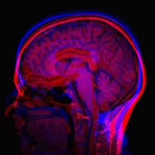

Non-rigid Registration
======================

Non-rigid registration methods are capable of aligning images where correspondence cannot be achieved without localized deformations and can therefore better accomodate anatomical, physiological and pathological variability between patients. 

B-splines are often used to parameterize a free-form deformation (FFD) field. This is a much harder registration problem than any of the previous examples due to a much higher-dimensional parameter space and we are therefore best off using a multi-resolution approach with affine initialization. This is very easy to do in SimpleElastix.

Consider the following mean image of two different subjects.

    Figure 13: Mean original image.

The following code runs multi-resolution affine initialization and starts a non-rigid method multi-resolution non-rigid method using the affine transform as initialization :

::

	import SimpleITK as sitk

	SimpleElastix = sitk.SimpleElastix()
	SimpleElastix.SetFixedImage(sitk.ReadImage("fixedImage.nii"))
	SimpleElastix.SetMovingImage(sitk.ReadImage("movingImage.nii"))

	parameterMapVector = sitk.VectorOfParameterMap()
	parameterMapVector.append(sitk.GetDefaultParameterMap("affine"))
	parameterMapVector.append(sitk.GetDefaultParameterMap("bspline"))
	SimpleElastix.SetParameterMap(parameterMapVector)

	SimpleElastix.Execute()
	sitk.WriteImage(SimpleElastix.GetResultImage())

The result image is seen below.

.. figure:: _static/PostNonrigid.jpg
    :align: center
    :figwidth: 90%
    :width: 75% 

    Figure 14: Mean result image.

In this case, we are able to compensate for many non-rigid differences between the two images. Note, however, that brain image registration is a difficult to task because of complex anatomical variations. `Entire registration packages <http://freesurfer.net/>`_ are dedicated to brain image processing. You might want to consider a more refined approach in critical applications.

In the next section we introduce groupwise registration, where many images are registered simultaneously a mean frame of reference.
