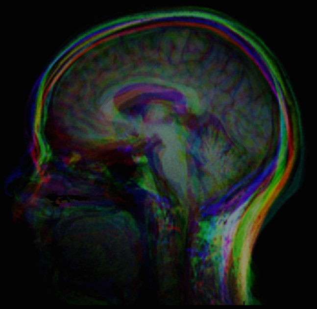

.. _GroupwiseRegistration:

Groupwise Registration
======================

Groupwise registration methods try to mitigate uncertainties associated with any one image by simultaneously registering all images in a population. This incorporates all image information in registration process and eliminates bias towards a chosen reference frame. The method described here uses a 3D (2D+time) or 4D (3D+time) free-form B-spline deformation model and a similarity metric that minimizes variance of intensities under the constraint that the average deformation over images is zero. This constraint defines a true mean frame of reference that lie in the center of the population without ever having to calculate it explicitly. 

The method can take into account temporal smoothness of the deformations and a cyclic transform in the time dimension. This may be appropriate if it is known a priori that the anatomical motion has a cyclic nature e.g. in cases of cardiac or respiratory motion.

Note that brain registration is a difficult to task because of complex anatomical variations and almost a scientific topic in itself. `Entire registration packages <http://freesurfer.net/>`_ are dedicated to just brain image processing. In this section we are less strict with the end result and focus on illustrating the groupwise registration method in SimpleElastix.

.. note::

    SimpleITK does not support 3D+t images yet. SimpleElastix authors have contributed 4D support upstream which will be merged in the next release. 

Consider the following mean image:

    Figure 12: Mean original image.

Elastix takes a single N+1 dimensional image for groupwise registration. Therefore we need to first concatenate the images along the higher dimension. SimpleITK makes this very easy with the :code:`JoinSeries` image filter. The registration step is business as usual:

::
    
    import SimpleITK as sitk

    # Concatenate the ND images into one (N+1)D image
    population = ['image1.hdr', ..., 'imageN.hdr']
    vectorOfImages = sitk.vectorOfImage()

    for filename in population
      vectorOfImages.push_back(sitk.ReadImage(filename))

    image = sitk.JoinSeries(vectorOfImages)

    # Register
    elastix = sitk.SimpleElastix()
    elastix.SetFixedImage(image) 
    elastix.SetMovingImage(image)
    elastix.SetParameterMap(selx.GetDefaultParameterMap('groupwise'))
    elastix.Execute()

While the groupwise transform works only on the moving image we need to pass a dummy fixed image is to prevent elastix from throwing errors. This does not consume extra memory as only pointers are passed internally. It is clear from the following figure that anatomical correpondence is obtained in many regions of the brain. 

The result image is shown in Figure 13. There are a some anatomical regions that have not been registered correctly, particularly near Corpus Collosum, but overall the images have been brought into the same anatomical frame of reference. In a later chapter we introduce methods for assessment of registration quality.

.. figure:: _static/PostGroupwise.jpg
    :align: center
    :figwidth: 90%
    :width: 75% 

    Figure 13: Mean result image. 
