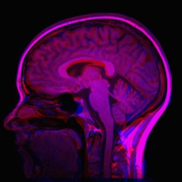

Non-rigid Registration
======================

Non-rigid registration methods are capable of aligning images where correspondence cannot be achieved without localized deformations. For example, a non-rigid transformations can better accomodate anatomical, physiological and pathological variability between patients. Further, a rigid body assumption can be violated by imperfect scanner-induced geometrical distortions regardless of the tissue being imaged.

B-splines are often used to parameterize a free-form deformation (FFD) field. This is a much harder registration problem than any of the previous examples due to a much higher-dimensional parameter space and the many more local minimas that follow. You are therefore best off using a multi-resolution approach with affine initialization. This is very easy to do in SimpleElastix.

Consider the following mean image of two different subjects.

.. figure:: _static/PreNonrigid.jpg
    :align: center
    :figwidth: 90%
    :width: 75% 

    Figure 13: Mean original image.

We can obtain a multi-resolution affine initialization, propagate the result a non-rigid method and run the multi-resolution non-rigid registration algorithm as follows:

::

	import SimpleITK as sitk

	elastix = sitk.SimpleElastix()
	elastix.SetFixedImage(sitk.ReadImage("fixedImage.nii"))
	elastix.SetMovingImage(sitk.ReadImage("movingImage.nii"))

	plist = sitk.ParameterMapList()
	plist.append(sitk.GetDefaultParameterMap("affine"))
	plist.append(sitk.GetDefaultParameterMap("nonrigid"))
	elastix.SetParameterMapList(plist)

	elastix.Execute()
	sitk.WriteImage(elastix.GetResultImage())

The result image is seen below.

    Figure 14: Mean result image.

Note that brain image registration is a difficult to task because of complex anatomical variations. `Entire registration packages <http://freesurfer.net/>`_ are dedicated to brain image processing. You might want to consider an even more refined approach in critical applications.

In the next section we introduce groupwise registration, where many images are registered simultaneously a mean frame of reference.
