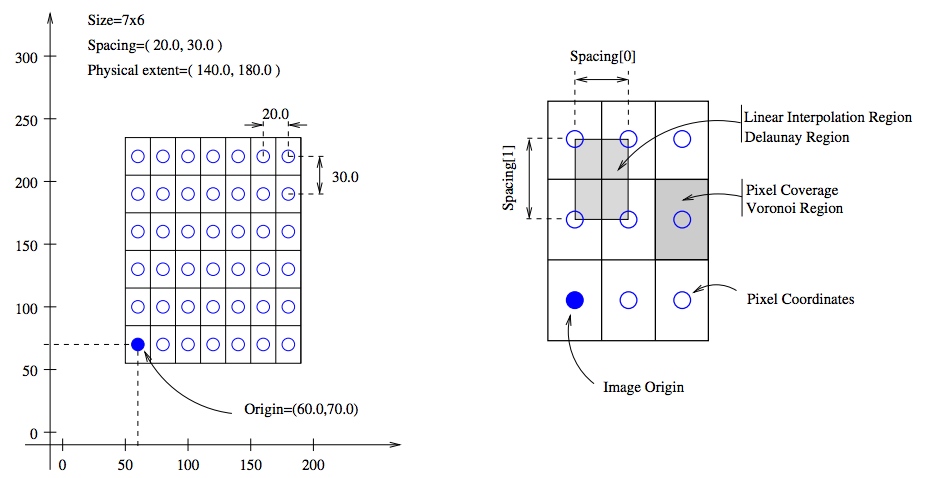

Registration Components
=======================

In this section we introduce the different choices for each type of component and some common terminology. For a technical discussion and equations see the `elastix manual <http://elastix.isi.uu.nl/download/elastix_manual_v4.7.pdf>`_. For documentation of source code see the `elastix doxygen pages <http://elastix.isi.uu.nl/doxygen/index.html>`_ where you will also find a `complete list of available parameters <http://elastix.isi.uu.nl/doxygen/parameter.html>`_.

Images
------
It is important to know the appropriate definitions and terms when working with medical images. In particular, information associated with physical spacing between pixels and position on the image grid with respect to world coordinate system is extremely important. Improperly defined spacing and origins will most likely result in inconsistent results. The main geometrical concepts associated with an image object are depicted in Figure 7. 

    Figure 7: Geometrical concepts associated with the ITK image. Adopted from Ibanez et al. (2005).

Above, circles are used to represent the centre of pixels. The value of the pixel is assumed to exist as a Dirac Delta Function located at the pixel centre. Pixel spacing is measured between the pixel centres and can be different along each dimension. The image origin is associated with the coordinates of the first pixel in the image. A pixel is considered to be the rectangular region surrounding the pixel centre holding the data value.

You should take great care that you use an image format that is able to store the relevant information, like .mhd, DICOM or NiftI file formats. SimpleElastix will use direction cosines by default. Make sure you know what you are doing before turning it off.

Image Pyramids
--------------

A multi-resolution pyramid strategy improves the capture range and robustness of the registration. There are three types of pyramids available in elastix: SmoothingImagePyramid, RecursiveImagePyramid and ShrinkingImagePyramid. The FixedImagePyramid and the MovingImagePyramid have identical options. The SmoothingImagePyramid smoothes the images with a Gaussian kernel at different scales. The RecursiveImagePyramid smoothes and downsamples the image. The ShrinkingImagePyramid merely downsamples the image. In general, you should be using the SmoothingImagePyramid together with a random sampler, since it will not throw away valuable information and a few thousend samples is often sufficient for a good approximation to the true gradient. It may consume quite some memory though for large images and many resolution levels, however. 

A pyramid schedule defines the amount of blurring and/or down-sampling in each direction x, y, z and for each resolution level.  Two parameters have to be set to define the multi-resolution strategy: :code:`NumberOfResolutions` and :code:`FixedImagePyramidSchedule` which is the level of smoothing and/or down-sampling that applied in each resolution. If you only set the :code:`NumberOfResolutions`, a default schedule will be used that smoothes the fixed image by a factor of 2 in each dimension, starting from :math:`\sigma = 0.5` in the highest resolution. This schedule is usually fine. If you have highly anisotropic data, you might want to blur less in the direction of the largest spacing.

In general, 3 resolutions are sufficient. If the fixed and moving image are initially far away, you can increase the number of resolution levels to, say, 5 or 6. This way the images are more blurred and more attention is paid to register large, dominant structures. The resolution schedule is specified as follows:

::

    (NumberOfResolutions 4)
    (FixedImagePyramidSchedule 8 8 8 4 4 4 2 2 2 1 1 1)

In this example 4 resolutions for a 3D image are used. At resolution level 0 the image is blurred with :math:`\sigma = 8/2`
voxels in each direction (:math:`\sigma` is half the pyramid schedule value). At level 1 :math:`\sigma = 4/2` is used, and finally at level 4 the original images are used for registration. Specifying the fixed and moving image
pyramids with an identical schedule can be done with one command:

::

    (ImagePyramidSchedule 4 4 2 2 2 1 1 1 1) 

for a 3D image with 3 resolution levels, where less smoothing is performed in the z-direction.

Masks
-----

Sometimes you are specifically interested in aligning certain objects in an image. For example, if you are registering CT images of lungs which vary considerably due to breating motion, you may not want to align the more static rib cage at the expense of lung overlap. One possibility is to crop the image, but this approach restricts the Region Of Interest (ROI) to be a square (2D) or cube (3D) only. If you need an irregular shaped ROI, you can use masks. A mask is a binary image filled with 0’s and 1’s. Intensity values are only sampled within regions filled with 1's.

You should use a mask when: 

- Your image contains an artificial edge that has no real meaning. The registration might be tempted to align these artificial edges, thereby neglecting the meaningful edges. The conic beam edge in ultrasound images is an example of such an artificial edge.
- The image contains structures in the neighbourhood of your ROI that may influence the registration within your ROI as in the lung example.

Masks can be used both for fixed and moving images. A fixed image mask is sufficient to focus the registration on a ROI, since samples are drawn from the fixed image. You only want to use a mask for the moving image when your moving image contains highly pertubed grey values near the ROI.

In case you of multi-resolution registation you also need to set :code:`(ErodeMask "true")` or information from the artificial edge will flow into you ROI due to the smoothing step. If the edge around your ROI is meaningful, as in the lung example where the edges of lungs needs to be aligned, you should set it to false, because this edge will help to guide the registration.
 
Transforms
----------

The choice of transform is essential for successful registration and, perhaps more importantly, what we perceive as "successful". The transform reflects the desired type of transformation and constrain the solution space to that type of deformation. For example, in intra-subject applications it may be sufficent to consider only rigid transformations if you are registering bones while a cross-sectional study demands more flexible transformation models to allow for local deformations and normal anatomical variability between patients.

The number of parameters of the transform corresponds to the degrees of freedom (DOF) of the transformation. This number varies greatly from 3 DOFs for 3D translation and 9 DOFs for 3D affine warping to anywhere between hundreds and millions of DOFs for non-parametric methods and b-spline deformation fields depending on the control point grid.

The number of DOFs is equal to the dimensionality of the search space and directly proportional to the computational complexity of the optimization problem which affects the likelihood of convergence to an optimal solution. Notice that there is a distinction between convergence to an optimal solution and a good registration result. If we use a 2D translation transform embedded in a multi-resolution approach, chances are we will find the global optimal solution. That does not garuantee the same level of anatomical correspondence, however, which will most likely require a more complex deformation model. On the other hand, registering complex anatomical structures using a b-spline deformation without proper initialization is most likely going to fail. Therefore it is often a good idea to start with simple transforms and propagate the solution through transforms of gradually increasing complexity. 

Some common transforms are (in order of increased complexity) translation, rigid (roation, translation), Euler (rotation, translation, scaling), affine (rotation, translation, scaling, shearing), b-spline (non-rigid), Spline-Kernel Transform (non-rigid) and weighted combinations of any of these.

Metrics
-------

The similarity metric measures the degree of similarity between the moving and fixed image and is a key component in the registration process. The metric samples intensity values from the fixed and transformed moving image and evaluates the fitness value and derivatives, which are passed to the optimizer. 

Selecting an appropriate metric is highly dependent on the registration problem to be solved. For example, some metrics have a large capture range while others require initialization close to the optimal position. In addition, some metrics are only suitable for comparing images obtained from the same imaging modality, while others can handle inter-modality comparisons. There are no clear-cut rules as to how to choose a metric and it may require a trial-and-error process to find the best metric for a given problem.

The Mean Squared Difference (SSD) metric computes the mean squared pixel-wise intensity differences between the fixed and moving images. The optimal value of the metric is zero. Poor matches are result in large values of the metric. The metric samples intensity values from the fixed and transformed moving image and evaluates the fitness value and derivatives, which are passed to the optimizer. This metric relies on the assumption that intensity representing the same homologous point must be the same in both images and only suited for two images with the same intensity distributions, i.e. for images from the same modality.

Normalized Correlation Coefficient (NCC) computes pixel-wise cross-correlation normalized by the square root of the autocorrelation of the images. The metric is invariant to linear differences between intensity distributions and is therefore particularly well suited for intra-modal CT registration where intensity scales are always related by a linear transform even between scanners. This metric produces a cost function with sharp peaks and well-defined minima, but therefore has a relatively small capture radius.

The Mutual Information (MI) measure computes the mutual information between two images and is more general. MI is a measure of how much information one random variable (image intensity in one image) tells about another random variable (image intensity in the other image). This corresponds to measuring the dependency of the probability density distributions (PDF) of the intensities of the fixed and moving images without having to specify the actual form of the dependency. It is therefore well suited for multi-modal image pairs as well as mono-modal images.  Normalized Mutual Information is likewise suitable for both mono- and multi-modality registration. Some studies seem to indicate better performance with NMI than MI in some cases.

Mattes Mutual Information is an implementation where the same pixels are sampled in every iteration. Using a fixed set of discrete positions to evaluate the marginal and joint PDFs makes the path in search space more smooth.

The Kappa Similarity metric measures the overlap of segmented structures and is developed specifically to register binary images (segmentations). In most cases however, it is better to convert the binary images to a distance map and apply one of the usual metrics. 

Optimizers
----------

The optimizer estimates the optimal transform parameters in iterative fashion. Many optimizers are available in elastix including Gradient Descent (GD), Robbins-Monroe (RM), Adaptive Stochastic Gradient Descent (ASGD), Conjugate Gradient (CG), Conjugate Gradient FRPR, Quasi-Newton LBFGS, RSGD "Each parameter apart", Simultaneous Pertubation (SP), CMAEvolutionStrategy and FullSearch which samples the entire search space. If you do not have any immediate preferences, stick to the Adaptive Stochastic Gradient Descent (Klein 2009) which requires less parameters to be set and tends to be more robust. For an elabore discussion see the `elastix manual <http://elastix.isi.uu.nl/download/elastix_manual_v4.7.pdf>`_.

Samplers
----------

The sampler is responsible for selecting locations in input images for the metric to evaluate. In general, it is sufficient to evaluate only a subset of randomly sampled voxels. SimpleElastix comes with a grid, random, random coordinate and full sampling strategies selected using the :code:`ImageSampler` parameter.

The grid sampler defines a regular grid on the fixed image and selects the coordinates onthe grid. Effectively, the image is down-sampledwithout smoothing. The size of the grid or downsampling factor is taken as input. The random sampler randomly selects a user-specified number of voxels. Every voxel has equal chance to be selected and a sample may be selected more than once. The random coordinate sampler is not limited to voxel positions but may sample positions between voxels. The off-grid grey-level values are obtained via in interpolation.

Interpolators
-------------

The metric typically compares intensity values in the fixed image against the corresponding values in the transformed moving image. When a point is mapped from one space to another by a transform, it will generally be mapped to a non-grid position. Interpolation is required to evaluate the image intensity at the mapped off-grid position.

Several methods for interpolation exist, varying in quality and speed. The :code:`NearestNeighborInterpolator` returns the value of the spatially closest voxel. This technique is low in quality but require little resources. You will want to use this method for binary images.

The :code:`LinearInterpolator` returns a weighted average of surrounding voxels using distances as weights. In elastix, this method is highly optimized and very fast. In general, you will probably want to use this method together with the random coordinate sampler during the optimization process for best performance (in the time sense).

The :code:`BSplineInterpolator` (or the more memory effecient :code:`BSplineInterpolatorFloat`) interpolates pixel values using b-spline approximations of user-defined order :math:`N`. First order b-splines corresponds to linear intepolation in which case you might as well use the linear interpolator. To generate the final result image a higher-order interpolation is usually required for which :math:`N = 3` is recommended. The final interpolator is called a ResampleInterpolator. Any one of the above methods can be used, but you need to prepend the name with Final, for example :code:`FinalBSplineInterpolatorFloat`

In the next section we will introduce the object-oriented programming interface.

